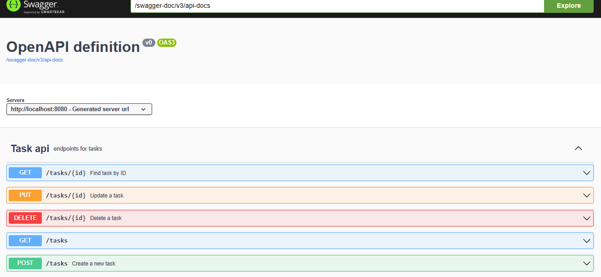
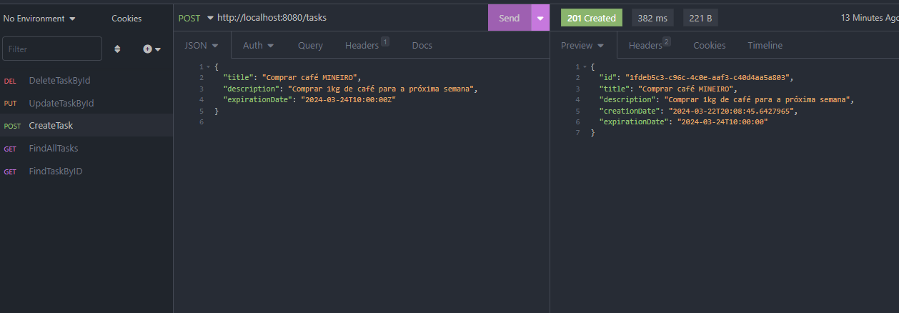

# ToDo List API

## Overview

This project is a reactive web application for managing a to-do list. It utilizes Spring Boot with R2DBC for reactive database access and Spring WebFlux for handling asynchronous stream-based data. The API allows for creating, retrieving, updating, and deleting tasks, with an emphasis on non-blocking and reactive operations.

## API Documentation

The API documentation is automatically generated using Springdoc OpenAPI. The interactive API documentation, provided by Swagger UI, can be accessed at `http://localhost:8080/swagger-doc/swagger-ui.html` when the server is running.



In addition to the Swagger UI, an Insomnia collection is also provided for convenience:



## Technology Stack

- **Spring Boot**: Framework for creating stand-alone, production-grade Spring-based applications.
- **R2DBC**: Reactive Relational Database Connectivity for scalable and event-driven database access.
- **Spring WebFlux**: Reactive-stack web framework, allowing for asynchronous and non-blocking event-driven web applications.
- **PostgreSQL**: Open-source relational database.
- **Docker**: Platform for developing, shipping, and running applications inside isolated containers.

## Running the Application

There are two Docker Compose configurations provided with this project:

1. **Production**: The standard Docker Compose configuration.
   - To run the application using this configuration, execute the following command:
     ```sh
     docker-compose up
     ```

2. **Development**: A Docker Compose configuration tailored for development purposes.
   - To run the application using the development configuration, use the following command:
     ```sh
     docker-compose -f docker-compose-dev.yaml up --build
     ```

The development Docker Compose file builds the image from scratch, ensuring that any local changes to the codebase are included in the containerized environment.

## Configuration Details

The application is configured to run on port `8080`. The R2DBC URL, username, and password are set for PostgreSQL database access. These values are specified in the `application.yaml` file for Spring's configuration and overridden by the environment variables in the Docker Compose files when running in a containerized environment.

The `docker-compose.yaml` sets up two main services:

- `todolist-application`: The core application service.
- `todolist-database`: A PostgreSQL database service.

## Volumes

The PostgreSQL database data is persisted using a Docker volume named `postgres_data`. This ensures that the database state is maintained across container restarts.

## Logging

Logging is configured to output at the INFO level for Spring Framework classes. This setting can be adjusted as necessary in the `application.yaml` file.

## Further Information

For more details on the implementation, refer to the auto-generated API documentation when the application is running, or explore the codebase for in-depth understanding of the underlying services and controllers.
